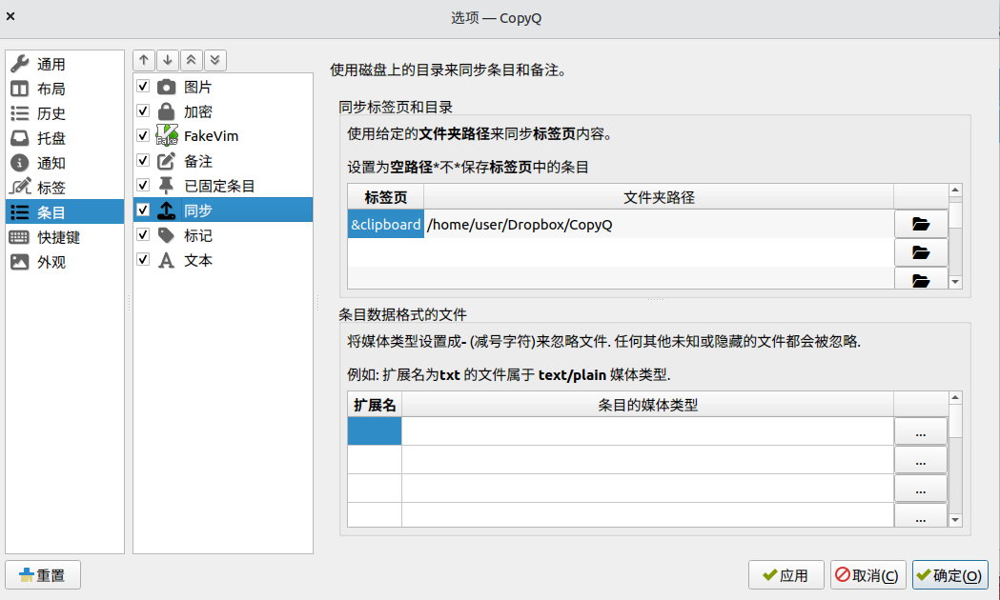
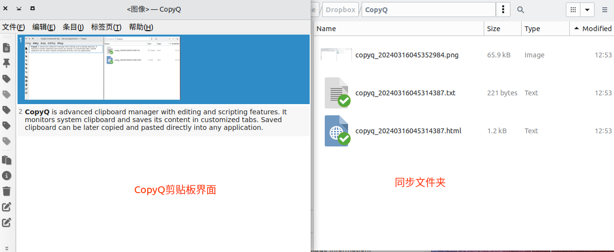

## 需求很简单
- 跨平台支持（Windows/Linux）
- 剪贴板同步（联网或局域网均可）
- 无需手动推送，复制到剪贴板后自动同步

但是试用了很多剪贴板管理工具，总是有各种各样的问题：

### (1) [Ditto](https://github.com/sabrogden/Ditto)
- 缺点： 只支持Windows
### (2) [Barrier](https://github.com/debauchee/barrier)
- 优点：日常用作虚拟KVM管理，支持剪贴板同步
- 缺点：同步功能总是会莫名失灵，不支持文件复制，复制图片等较大内容时（几百KB~几兆），会导致KVM十分卡顿
### (3) [Kde-connect](https://github.com/debauchee/barrier)
- 优点：多平台同步（Windows/Linux/MacOS/ios/Android），支持发送文件
- 缺点：Win10下使用会占用剪贴板，使得 Ctrl-C/V 失灵
### (4) [CopyQ](https://github.com/hluk/CopyQ)
- 优点：很棒，基本能满足我的使用需求
- 缺点：同步功能需要第三方软件（坚果云/Dropbox等）

## 剪贴板管理工具-CopyQ
这里只介绍同步功能的设置方法，其他功能请参考[官方文档](https://copyq.readthedocs.io/en/latest/)或网络资料。
### 安装
- Ubuntu-22.04
  ```sh
  sudo add-apt-repository ppa:hluk/copyq
  sudo apt update
  sudo apt install copyq
  ```
- Windows  
  下载[安装包CopyQ-*.*-setup.exe](https://github.com/hluk/CopyQ/releases)
### 配置同步功能
同步功能是将剪贴板存储到指定的同步文件夹内， 因此需要使用第三方云盘同步软件，例如坚果云、Dropbox等有跨平台支持的云盘服务。

以`Dropbox`为例，Ubuntu下Dropbox的同步文件夹位于`/home/user/Dropbox`，Windows下位于`D:\Dropbox`:
#### Ubuntu-22.04
创建`CopyQ`的同步文件夹`/home/user/Dropbox/CopyQ`。
打开CopyQ，查看`文件`-`首选项`-`标签`：


默认剪贴板存放在`&clipboard`标签页下。
设置`文件`-`首选项`-`条目`-`同步`， 标签页设置为上图中的标签`&clipboard`，文件夹路径设置为刚刚创建的同步文件夹`/home/user/Dropbox/CopyQ`，点击`应用`。

设置完成。

#### Windows
设置方法相同，但是要注意Windows下默认的标签为`剪贴板(&C)`：


复制任意文字或图片后，可以看到同步文件夹下生成的`copyq_<timestamp>.*`文件，经由Dropbox自动同步到Windows端。


